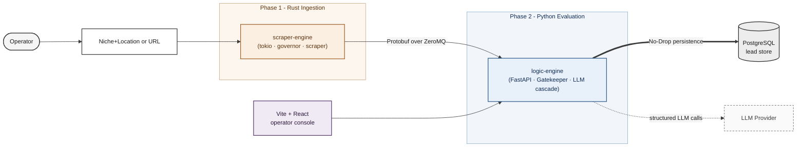

# TraceFabric

[](https://opensource.org/licenses/Apache-2.0)
[](https://www.rust-lang.org/)
[](https://www.python.org/)
[](https://www.postgresql.org/)
[](#project-status)

## Table of Contents

- [About](#about)
- [Key Features](#key-features)
- [Architecture](#architecture)
- [Documentation](#documentation)
- [Project Status](#project-status)
- [Local Development](#local-development)
- [Roadmap](#roadmap)
- [Ethics](#ethics)
- [License](#license)

## About

TraceFabric is an asynchronous lead-ingestion and tiered evaluation engine.

AI-powered lead-qualification tools typically run an LLM call on every candidate before any filtering. That's expensive at volume, and the qualification decision is untraceable as there's no record of why a lead was kept or dropped beyond the model's output.

The design is a cost-gated cascade: cheap, evidence-backed, repeatable deterministic checks run first, and LLM stages only run on candidates that earn the spend.

## Key Features

* **Crawler (Rust):** Async ingestion built on `tokio` and `reqwest`, with rate-limiting via `governor` and HTML parsing via the `scraper` crate. Serializes results into Protobuf and pushes over ZeroMQ for downstream Python evaluation.
* **Schema-Enforced IPC:** Unidirectional layer between Rust and Python, built on Protobuf and ZeroMQ. Per-message decode time at 0.0082 ms per message on localhost (1000-message benchmark, [spike](https://github.com/tesahe/trace-fabric/issues/1#issuecomment-4206098314)).
* **Cost-Gated LLM Cascade:** A deterministic stage filters leads before any LLM call. Two LLM stages: one validates the deterministic signals, the other extracts structured fields via Instructor.
* **"No-Drop" Mandate:** Every lead is persisted to Postgres regardless of outcome - qualified or rejected (including compliance exclusions). The persisted record is intended to support training a learned gatekeeper.

## Architecture



## Documentation

**Architecture**

- [Architecture](docs/ARCHITECTURE.md)
- [Data Model](docs/DATA_MODEL.md)
- [Evaluation Strategy](docs/EVALUATION_STRATEGY.md)
- [Decisions (ADR log)](docs/DECISIONS.md)
- [Roadmap](docs/ROADMAP.md)

**Diagrams**

- [Evaluation Cascade](docs/evaluation-cascade.md)
- [Pipeline Sequence](docs/pipeline-sequence.md)
- [Data Lifecycle](docs/data-lifecycle.md)

## Project Status

TraceFabric is an active project; the Rust ingestion layer is functional and current work is on the Python evaluation pipeline. It is not currently packaged for public redistribution. The repository is open so reviewers can read the code, the architecture decisions, and the evaluation strategy.

## Local Development

This section is for reviewers, contributors, and future-me. The [Documentation](#documentation) and [Architecture](#architecture) sections give the full picture without needing to run anything locally.

### Prerequisites

Versions reflect what's pinned in this repo today.

* Docker & Docker Compose
* Rust 1.85+ with Cargo (project uses edition 2024, `tokio` 1.51)
* Python 3.11+ (logic-engine pins `protobuf` 6.33, `pyzmq` 27.1)
* Node 20+ (frontend uses Vite 5, React 18, TypeScript 5)
* PostgreSQL 15 (provisioned via `infra/docker-compose.yml`)
* `protoc` (Protocol Buffer compiler) — required to build the Rust side

### Running locally

1. Start the data infrastructure (Postgres 15):

   ```bash
   docker compose -f infra/docker-compose.yml up -d
   ```
2. Start the Python logic-engine (deterministic eval + LLM router):

   ```bash
   cd logic-engine
   pip install -r requirements.txt
   uvicorn app.main:app --reload
   ```
3. In a new terminal, start the Rust scraper-engine (ingestion + IPC):

   ```bash
   cd scraper-engine
   cargo run --release -- discover --industry "plumbers" --location "seattle" --limit 10 --run-id "local-test-1"
   ```
4. Start the operator console to view live evaluations:

   ```bash
   cd frontend
   npm install
   npm run dev
   ```


## Roadmap

See [ROADMAP.md](docs/ROADMAP.md) for a phase-by-phase plan with exit criteria.

## Ethics

TraceFabric implements the following guardrails:

1. **User-Agent Transparency:** Every request identifies as `TraceFabric/1.0 (+https://github.com/tesahe/trace-fabric)`.
2. **Robots.txt Compliance:** The Rust ingestion layer parses `robots.txt` and respects crawl exclusions. Disallowed sites are recorded as excluded leads and are never fetched.
3. **Rate-Limiting:** Rate-limiting via the `governor` crate to prevent server strain.
4. **Data Minimization:** The persisted record stores extracted signals and decisions, not raw page content.
5. **Auditable Decisions:** Every qualification or rejection is backed by deterministic evidence and persisted alongside model outputs.

## License

TraceFabric is licensed under Apache License 2.0. See the `LICENSE` file for more information.
