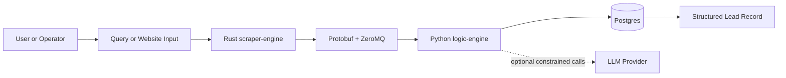
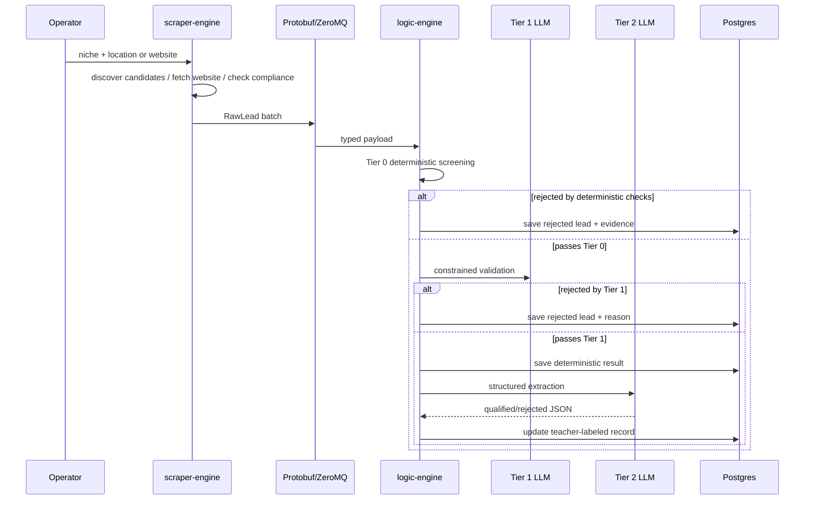

# TraceFabric

TraceFabric is an async lead-evaluation pipeline for small-batch business website analysis. It starts from a niche-and-location query or a known website, extracts deterministic website evidence, applies staged LLM validation, and stores structured qualification results as reusable teacher-labeled data.

The project is designed to show applied AI engineering rather than generic scraping. The core story is typed service boundaries, cost-aware LLM cascading, auditable outputs, and a dataset foundation for future student-model training.

## Why This Project Matters

Most lead-gen tooling either stops at scraping or jumps straight to opaque AI summaries. TraceFabric takes a different approach:

- It keeps discovery small-batch and treats it as setup, not the differentiator.
- It extracts evidence-backed website signals before spending LLM tokens.
- It uses staged evaluation so cheap deterministic checks and narrower LLM passes reduce cost and improve traceability.
- It persists each evaluated lead as a structured record that can later support lower-cost local modeling.

## What This Project Demonstrates

- Async systems design across Rust and Python services
- Typed inter-process boundaries with Protobuf and ZeroMQ
- Cost-aware LLM routing and cascading evaluation
- Structured extraction instead of free-form AI summaries
- Teacher-labeled dataset creation for future model handoff
- Explainable, evidence-backed qualification logic

## Core Architecture

TraceFabric currently has four major parts:

1. `scraper-engine` in Rust handles small-batch discovery, compliance checks, homepage fetches, and typed lead payload assembly.
2. Protobuf plus ZeroMQ provide the async service boundary between ingestion and evaluation.
3. `logic-engine` in Python performs deterministic screening, optional constrained LLM validation, optional structured extraction, and persistence.
4. Postgres stores the canonical lead record, deterministic evidence, workflow status, and future teacher-label data.

### System Context

This diagram is the recruiter-friendly overview: one ingestion service, one evaluation service, one persistence layer, and optional LLM calls only when the pipeline needs them.

## LLM Cascading And Evaluation

The pipeline is intentionally staged instead of relying on one large model call:

1. Deterministic evidence extraction captures website signals like mobile readiness, contact presence, forms, privacy markers, and crawl/compliance state.
2. Tier 0 heuristic screening rejects obvious junk or campaign mismatches cheaply.
3. Tier 1 constrained LLM validation checks whether the site appears to be a real local business before more expensive extraction work.
4. Tier 2 structured extraction produces a constrained, schema-driven lead assessment.
5. The resulting record is stored as a teacher-labeled artifact for later student-model experimentation.

### Pipeline Flow

This is the main interview diagram because it shows cost control, workflow branching, and where structured outputs enter the system.

## Current Capabilities

The current repository already supports the core shape of the system:

- Rust discovery and fetch scaffolding for small candidate sets
- Compliance-aware fetch path with typed payload construction
- Protobuf contract between ingestion and evaluation services
- Tier 0 heuristic scanning and deterministic lead evaluation
- Optional Tier 1 constrained business-validation pass
- Optional Tier 2 structured extraction orchestrator
- Postgres-backed canonical lead storage

The current emphasis is pipeline integrity and demo readiness, not high-volume discovery or production-scale crawling.

## Demo Flow

A realistic demo path for the project is:

1. Start with a small niche-and-location query such as `autobody shops in San Francisco`.
2. Let the Rust service discover a short candidate set and fetch the homepage of each site.
3. Show the typed payload crossing the Rust-to-Python boundary.
4. Show deterministic evidence such as contact signals, forms, viewport presence, trust markers, and crawl state.
5. Show whether the lead is rejected early or passed to the LLM stages.
6. Show the final persisted row containing qualification state, evidence, and structured outputs.

## Technical Design Principles

- Small-batch discovery over scraping-platform ambition
- Typed boundaries over loose JSON handoffs
- Bounded queues and async workers over blocking monolith flows
- Evidence-backed qualification over opaque model summaries
- Cost discipline over always-on model usage
- Dataset readiness over premature student-model optimization

## Roadmap

### Current

- Rust and Python services exist with a typed async boundary
- Deterministic evaluation and persistence scaffolding are in place
- Tiered LLM flow exists conceptually and partially in code

### Next

- Complete a demo-ready vertical slice that runs cleanly end to end
- Tighten setup, verification, and result inspection paths
- Expand deterministic evidence only where it improves the demo and label quality

### Later

- Add a reliable demo dataset or cached candidate path
- Formalize teacher-label export for baseline student-model experiments
- Improve observability and operational polish for broader real-world use

## Documentation

- [Project Overview](docs/OVERVIEW.md)
- [Architecture](docs/ARCHITECTURE.md)
- [Data Model](docs/DATA_MODEL.md)
- [Evaluation Strategy](docs/EVALUATION_STRATEGY.md)
- [Roadmap](docs/ROADMAP.md)
- [Demo Guide](docs/DEMO.md)
- [Key Decisions](docs/DECISIONS.md)

## Diagram Index

- [System Context Diagram](docs/diagrams/system-context.md)
- [Pipeline Sequence Diagram](docs/diagrams/pipeline-sequence.md)
- [Evaluation Cascade Diagram](docs/diagrams/evaluation-cascade.md)
- [Data Lifecycle Diagram](docs/diagrams/data-lifecycle.md)
- [Runtime Component Diagram](docs/diagrams/runtime-components.md)

## Project Status

TraceFabric should be read as an applied-AI systems project in active development. The current public scope is a small-batch lead-evaluation pipeline with deterministic evidence extraction, constrained LLM cascading, and persisted structured outputs. It is not positioned as a mass-ingestion scraper, a generic agent platform, or an autonomous deployment system.

## License

TraceFabric is licensed under Apache License 2.0. See [LICENSE](LICENSE).
