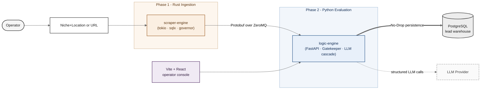

# TraceFabric

[](https://opensource.org/licenses/Apache-2.0)
[](https://www.rust-lang.org/)
[](https://www.python.org/)
[](https://www.postgresql.org/)
[](#project-status)

## Table of Contents

- [About](#about)
- [Key Features](#key-features)
- [Architecture](#architecture)
- [Documentation](#documentation)
- [Project Status](#project-status)
- [Local Development](#local-development)
- [Roadmap](#roadmap)
- [Ethics](#ethics)
- [License](#license)

## About

An async lead-ingestion and evaluation engine built for operators who need an ethical, cost-disciplined way to find and qualify local business leads by analyzing real websites for customer compatibility.

TraceFabric is an asynchronous, two-service pipeline that identifies localized digital service gaps and evaluates their economic viability. It bridges deterministic evaluation and staged LLM orchestration by being cost-aware: cheap, evidence-backed deterministic checks run first, and LLM stages only run on candidates that earn the spend.

Every decision — qualified, rejected, or excluded — is persisted as a structured, teacher-labeled record. That data foundation is the basis for future student-model training, so the pipeline gets cheaper and more self-sufficient over time.

## Key Features

* **Mass Ingestion Engine (Rust):** Memory-safe, high-concurrency crawling and DOM parsing built on `tokio`, `sqlx`, and `reqwest`.
* **ZeroMQ IPC Bridge:** Sub-millisecond inter-process communication using strict Protobuf serialization, bypassing HTTP/REST overhead between services.
* **Cost-Gated LLM Cascade:** A local XGBoost gatekeeper plus deterministic evidence extraction filter leads for economic viability before any frontier LLM tokens are spent. Tier 1 constrained validation and Tier 2 structured extraction (via Instructor) run only on candidates that earn the cost.
* **"No-Drop" Data Strategy:** All leads — qualified, rejected, or excluded — flow into a central PostgreSQL warehouse to build a teacher-student self-reinforcing cycle for future local model training.

## Architecture



## Documentation

Read the below links for additional information.

- [System Overview](docs/OVERVIEW.md)
- [Architecture](docs/ARCHITECTURE.md)
- [Data Model](docs/DATA_MODEL.md)
- [Evaluation Strategy](docs/EVALUATION_STRATEGY.md)
- [Frontend](docs/FRONTEND.md)
- [Roadmap](docs/ROADMAP.md)
- [Decisions (ADR log)](docs/DECISIONS.md)
- [Demo Guide](docs/DEMO.md)

## Project Status

TraceFabric is an active project demonstrating applied AI engineering across Rust, Python, and a typed IPC boundary. It is **not currently packaged for public redistribution** — there is no hosted demo, no published SDK, and no support model. The repository is open so reviewers can read the code, the architecture decisions, and the evaluation strategy alongside a live development log.

## Local Development

This section is for reviewers, contributors, and future-me. The [Documentation](#documentation) and [Architecture](#architecture) sections give the full picture without needing to run anything locally.

### Prerequisites

Versions reflect what's pinned in this repo today.

* Docker & Docker Compose
* Rust 1.85+ with Cargo (project uses edition 2024, `tokio` 1.51, `sqlx` 0.8)
* Python 3.11+ (logic-engine pins `protobuf` 6.33, `pyzmq` 27.1, `xgboost` 3.2)
* Node 20+ (frontend uses Vite 5, React 18, TypeScript 5)
* PostgreSQL 15 (provisioned via `infra/docker-compose.yml`)
* `protoc` (Protocol Buffer compiler) — required to build the Rust side

### Running locally

1. Start the data infrastructure (Postgres 15):

   ```bash
   docker compose -f infra/docker-compose.yml up -d
   ```
2. Start the Python logic-engine (deterministic eval + LLM router):

   ```bash
   cd logic-engine
   pip install -r requirements.txt
   uvicorn app.main:app --reload
   ```
3. In a new terminal, start the Rust scraper-engine (ingestion + IPC):

   ```bash
   cd scraper-engine
   cargo run --release
   ```
4. (Optional) Start the operator console:

   ```bash
   cd frontend
   npm install
   npm run dev
   ```

A walkthrough of the demo flow lives in [docs/DEMO.md](docs/DEMO.md).

## Roadmap

* **Phase 1:** `tokio` crawler + ZeroMQ/Protobuf IPC bridge benchmarked.
* **Phase 2:** Tier 0 Deterministic evidence extraction + FastAPI integration live.
* **Phase 3:** Deterministic structured-output generation via Instructor across Tier 1 and Tier 2.
* **Phase 4:** Gatekeeper-Eval CI/CD gate, OpenTelemetry tracing, teacher-label dataset export.
* **Phase 5:** XGBoost integration into Tier 0 with saturated dataset export.

See [ROADMAP.md](docs/ROADMAP.md) for detailed exit criteria and out-of-scope items.

## Ethics

TraceFabric is designed to be a responsible web citizen with the following guardrails hardcoded into the architecture.

1. **User-Agent Transparency:** Every request identifies as `TraceFabric/1.0 (+https://github.com/tesahe/trace-fabric)`.
2. **Robots.txt Compliance:** The Rust ingestion layer parses `robots.txt` and respects crawl exclusions. Disallowed sites are recorded as excluded leads and are never fetched.
3. **Rate-Limiting:** Implements a Token Bucket algorithm via the `governor` crate to prevent server strain.
4. **Data Minimization:** Only structural DOM markers required for economic viability analysis are retained; raw PII is not stored.
5. **Auditable Decisions:** Every qualification or rejection is backed by deterministic evidence and persisted alongside model outputs, so any decision can be inspected after the fact.

## License

TraceFabric is licensed under Apache License 2.0. See the `LICENSE` file for more information.
