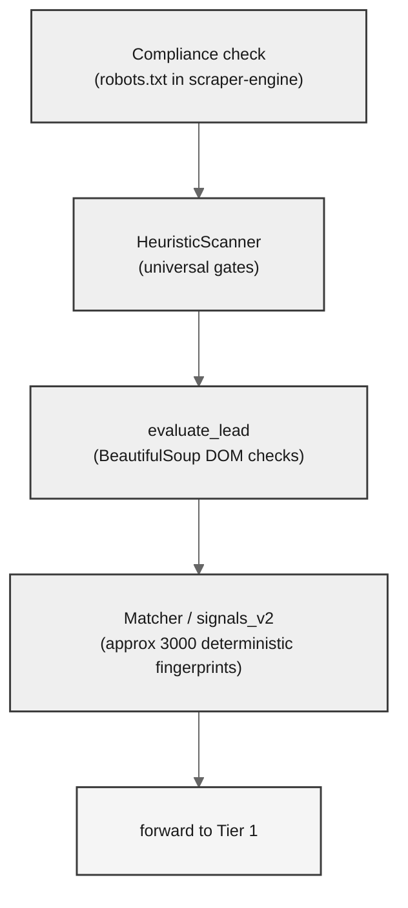

# Evaluation Strategy

## What this document answers

Why is TraceFabric's lead evaluation a staged cascade of cheap deterministic checks and rationed LLM calls instead of one large model invocation, and what concretely lives at each stage today?

This is the strategy companion to the [Evaluation Cascade](./evaluation-cascade.md) flowchart. The diagram shows *what* the cascade is; this document argues *why* it's shaped that way and where it's headed.

## The cost-aware cascade

A naive evaluator sends the full page to a frontier model and asks "is this a good lead?" That works, scales linearly with spend, and produces opaque scores that no operator can audit. TraceFabric refuses that tradeoff.

The cascade is a single thesis applied four times: **let the cheapest correct check run first, and only spend the next tier of cost on candidates that survive the previous tier.** Every layer is justified by what it eliminates from the next layer's bill.

- **Tier 0 (deterministic, zero token cost)** removes obvious junk — parked domains, builder-locked sites, sites failing universal quality gates. Pure CPU.
- **Tier 1 (constrained LLM, small token cost)** answers a single yes/no: is this a real local business in the target niche? Tight schema, tight prompt.
- **Tier 2 (structured LLM extraction, large token cost)** runs only on Tier 1 survivors that win a priority + budget auction. This is where structured business records get built.

The economic argument is straightforward: Tier 2 is roughly two orders of magnitude more expensive per call than Tier 1, which is itself roughly two orders of magnitude more expensive than Tier 0. Every junk lead Tier 0 rejects is an LLM call that never runs. Every non-business Tier 1 rejects is a structured extraction that never runs. Spend follows signal, not volume.

The No-Drop mandate runs orthogonal to all of this: rejected leads still persist with their `pipeline_status` and evidence, because hard negatives are training data the [data lifecycle](./data-lifecycle.md) is built to capture.

## Tier 0: deterministic depth before LLM tokens

Tier 0 is not one check — it is a four-stage internal pipeline, each stage cheaper or more focused than the next. After Sprint 1, this is the actual order:

**1. Compliance check.** Performed in the Rust `scraper-engine` *before* the lead is ever sent over ZeroMQ. If `robots.txt` disallows the path, the URL is persisted directly as `rejected_compliance` and Phase 2 never sees it. This is the cheapest possible rejection: no fetch, no IPC, no Python wakeup.

**2. HeuristicScanner — universal gates.** Word-count threshold (default 150), parked-domain phrase scan, hardcoded builder regex (Squarespace / Shopify CDN / Wix / Weebly for the modernization campaign), viewport presence. These are coarse filters that catch the long tail of "page exists but isn't a business website" before any structured analysis runs.

**3. `evaluate_lead` — BeautifulSoup DOM checks.** The original Tier 0 evaluator. Forms, `tel:` and `mailto:` links, contact and privacy anchors, booking phrases, hours, stale copyrights, directory-host detection. Produces a score via the current heuristic formula `min(1.0, 0.35 + 0.12 * len(missing) + 0.10 * len(outdated))`.

**4. Matcher — `signals_v2` (Sprint 1, behind `TRACEFAB_SIGNALS_V2`).** Around 3,000 deterministic technology fingerprints from vendored Wappalyzer + RetireJS packs, run against the previously-unused 70% of the `RawLead` payload (script srcs, stylesheets, response headers, cookies, meta tags, robots body). Each match emits a `Detection` with full audit metadata. The matcher is wrapped in try/except so it cannot break a lead — see [ARCHITECTURE.md](./ARCHITECTURE.md) for the engineering details (re2 + timeout, GPL containment, feature flag mechanics).

The progression is intentional: cheap → cheaper → broader → broadest with audit trail. Stage 4 adds depth, not gating. It does not yet alter the score in production; it produces the evidence Sprint 2 will consume.

## The explainability thesis

Every `Detection` produced by the matcher carries a complete provenance record: `name`, `pack`, `categories`, `confidence`, `version`, `source`, `matched_field`, `matched_value`, `pattern_id`. That last triple is the differentiator.

When this lead eventually scores 0.78, an operator can ask "why?" and the answer is concrete: *WordPress matched at confidence 100 via `meta[generator]="WordPress 6.4.2"`, plus Stripe matched via `script_srcs[2].url="https://js.stripe.com/v3/"`, plus an implied PHP detection at confidence 50 from the WordPress requires graph.* No black-box scoring, no "the model said so," no after-the-fact rationalization.

Most competitor scoring pipelines ship a single opaque number. TraceFabric ships the score and the receipts. The Sprint 1 commitment was to capture this evidence at the moment of detection, before any aggregation — so the future "why this lead scored 0.78" UI is unblocked because the data was always there. The scoring layer can change; the audit trail does not need to be reconstructed.

## Cost reasoning at Tier 0

`signals_v2` adds roughly 3,000 regex evaluations per lead. That cost is paid in milliseconds of CPU, not in tokens. Adding deterministic depth at Tier 0 is effectively free at the margin — the haystack is computed once per artifact source (one pass per source type, not one pass per pattern), regex compilation is amortized at process start, and the `Matcher` singleton is reused per request.

This is the operational point of the cascade: **deterministic depth is free; LLM tokens stay rationed.** A signature pack can grow from 3,000 to 30,000 patterns and the only cost increase is CPU. A single Tier 2 call costs more than a million matcher runs. The right place to add evaluation surface area is at the bottom of the cascade, not at the top.

## Confidence semantics

Confidence on a `Detection` is an integer 0-100 attached to the detection itself, not to the lead. It encodes how strongly the signature matched, not how strongly the lead is qualified. Two rules govern it:

- **Implied detections cap at 50.** When the resolver adds a tech via the `implies` graph (WordPress implies PHP + MySQL), the synthetic detection enters at confidence 50. A direct match at confidence 100 always wins the dedup tiebreak, so corroborating evidence promotes implied detections naturally.
- **Blocklist downgrades and corroboration requirements.** The curated false-positive blocklist (`signals/false_positive_blocklist.yaml`) caps confidence on signatures that are too generic on their own — Cloudflare on `cf-ray` alone, Google Analytics on script-src alone, Bootstrap on CSS alone. jQuery and Bootstrap additionally require corroboration: drop the detection unless at least one other tech survives in the same lead. These rules are curated by hand based on prior-art research and tuned as new false-positive families surface.

Lead-level scoring is upstream of all this. In Sprint 1, the legacy `evaluate_lead` formula still produces the lead score; detections are stored next to it as additive metadata. Sprint 2 introduces YAML weights per campaign that consume these detections and replace the heuristic formula.

## The resolver graph

Raw signature matching produces a set with overlaps and dependencies — Shopify themes that match because Shopify matched, WooCommerce traces left on a Shopify migration, MySQL that's clearly there because WordPress is clearly there. The resolver applies the Wappalyzer detection graph to clean this up:

- **Excludes.** Mutually exclusive techs drop the loser. Shopify excludes WooCommerce — if both somehow match, WooCommerce is dropped because the platform identity is the stronger signal.
- **Requires.** Detections whose required dependency isn't also detected get dropped. A "Shopify theme" signature requires Shopify itself; if Shopify didn't match, the theme detection is almost certainly noise.
- **Implies.** The matched tech adds its dependents at confidence 50. WordPress implies PHP + MySQL. Stripe implies the payment-processor category. Implied detections are flagged with `MatchSource.IMPLIED` so the audit trail stays honest about which detections were direct and which were inferred.

The whole pass runs as **fixed-point iteration up to 5 times** so transitively implied techs are caught (a theme implies a CMS implies a language). This matters because clean detection sets prevent double-counting in any future weighted scoring, and because no orphan dependencies sneak through to claim credit they didn't earn.

## Signature pack composition

Tier 0's matcher consumes three packs, each chosen for a different reason:

- **Wappalyzer (vendored from `enthec/webappanalyzer`).** Broad coverage — 4,193 raw entries filtered to 2,961 across 24 categories chosen for local-business lead qualification (CMS, ecommerce, marketing automation, payment processors, page builders, live chat, appointment scheduling, reviews, and others). The pack is GPL-3.0, so it is isolated under `signals/wappalyzer_pack/` with no Python code in that directory. The license boundary is auditable; see [ARCHITECTURE.md](./ARCHITECTURE.md) for the containment design.
- **RetireJS (Apache-2.0).** Vulnerability surface — 67 outdated/vulnerable JS library detectors. Used both as a tech signal and as a "this site has not been touched in years" indicator, which is itself signal for the modernization campaign.
- **`local_biz_pack` (hand-curated, Sprint 2/3).** Empty placeholder today. Will hold roughly 30-50 hand-written signatures for Booksy, Mindbody, Toast, ServiceTitan, Boulevard, Phorest, Housecall Pro, BirdEye, Podium, and the rest of the booking / POS / CRM platforms that matter for the local-business niche but are too narrow for upstream Wappalyzer.

The composition is deliberate: rent broad coverage from upstream, build narrow coverage in-house where the niche demands it.

## Tier 1 + Tier 2: LLM tiers

Tier 1 is a constrained LLM call answering a single question: *is this site a real local business in the target niche?* Output is a tight structured object — boolean plus confidence plus a short rationale. The prompt does not extract; it validates. This is what makes Tier 1 affordable: it never has to reason about full business records, only about category membership.

Tier 2 is full structured extraction via Instructor's JSON-schema-driven pattern. It runs asynchronously, dispatched via a priority queue with a per-run or daily USD budget cap. The priority score is derived from Tier 0 evidence and Tier 1 confidence — best-scored leads earn enrichment first; lower-priority leads stay as weak labels until budget refreshes.

This is the cost-discipline boundary made operational: scaling Tier 2 spend up or down is a configuration dial, not a code change. The full sequence — including which writes happen synchronously and which run async — is in the [Pipeline Sequence](./pipeline-sequence.md) document.

## What is still heuristic

Honest accounting of the judgment calls currently encoded as constants:

- **The 150-word threshold** in `HeuristicScanner`. Picked from prior-art benchmarks; awaits validation against the labeled URL set.
- **The `0.35 + 0.12 * missing + 0.10 * outdated` score formula** in `evaluate_lead`. Hand-tuned weights. Will be replaced by per-campaign YAML weights in Sprint 2 once the detection corpus is consumable.
- **The 24-category Wappalyzer allowlist.** Chosen by judgment for local-biz relevance; trims the upstream 60-plus categories to the ones that actually inform qualification.
- **The false-positive blocklist rules.** Five active rules today. Each is a curated response to a known noisy signature; the list grows as new false-positive families show up in fixture and benchmark runs.
- **The implied-detection confidence cap of 50.** A reasonable default that says "inferred is weaker than observed," but not data-derived.

Each of these is a defensible starting point that becomes a tuning target once Sprint 3's labeled benchmark URLs land. They are heuristic by design, not by oversight.

## Roadmap of strategy evolution

**Sprint 1 — done.** Detections are produced, resolved, blocklist-filtered, and stored. The score formula has not changed; the matcher is purely additive metadata living in `heuristic_flags["technologies"]`. Production behavior is unchanged until `TRACEFAB_SIGNALS_V2=1`.

**Sprint 2 — in progress.** YAML per-campaign weights consume the stored detections. The legacy 0.35-base formula is replaced by a weighted sum over detected technologies, scoped per campaign so the modernization campaign and the niche-matching campaign can score the same detection set differently. `local_biz_pack` gets its first 30-50 curated signatures. PageSpeed Insights and Mozilla Observatory integrations add free external signal (Core Web Vitals, performance, accessibility, security headers).

**Sprint 3 — gated on the labeled benchmark.** The 20-good plus 20-bad labeled URL set runs through the full pipeline. Precision and recall get measured per signal. YAML weights get tuned against ground truth. `signals_v2` flips from opt-in flag to default. The "why this lead scored 0.78" panel becomes a first-class operator-console feature, not a future commitment.

The arc is consistent: Sprint 1 collected the evidence, Sprint 2 starts using it, Sprint 3 validates and tunes against labels. The cascade shape doesn't change — only the depth and weight of each layer.

## Related diagrams

- [Evaluation Cascade](./evaluation-cascade.md) — visual flow of the cascade described here.
- [Pipeline Sequence](./pipeline-sequence.md) — time-ordered behavior of one lead through the same stages.
- [Data Lifecycle](./data-lifecycle.md) — how a row evolves through these stages and what `pipeline_status` it lands in.
- [System Context](../README.md#architecture) — recruiter-friendly zoom-out of the same system.
