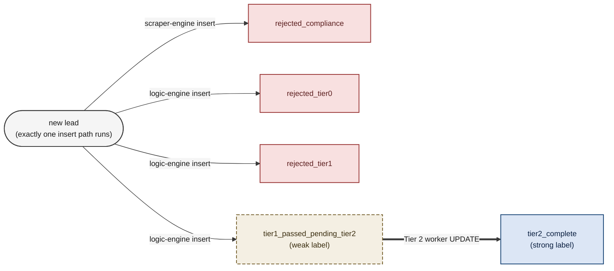

# Data Lifecycle

## What this diagram answers

How does a single lead's row in Postgres evolve from creation to terminal state, and which `pipeline_status` values are weak labels, strong labels, or terminal rejections?

## Diagram

## How to read it

Each box is a value of the `pipeline_status` column on the `leads` table. The four arrows leaving `new lead` are **mutually exclusive insert paths**: a single lead row commits with exactly one of those four statuses, depending on which gate it hit. The fan-out is not concurrency — it is alternative starting states for the same row. The four `rejected_*` and `tier2_complete` boxes are **terminal states** the row will not change from. The single non-terminal state is `tier1_passed_pending_tier2`: a real row already committed to the warehouse, carrying a weak label because Tier 2 enrichment hasn't run yet. The bold arrow from weak to strong is the only `UPDATE` in the system; every other arrow is an `INSERT`.

Color coding: warm beige for the weak label, cool blue for the strong label, soft red for terminal rejections.

## Label strengths

**Weak label — `tier1_passed_pending_tier2`.** The lead has passed deterministic evaluation and a constrained Tier 1 LLM check. The row exists with full Tier 0 evidence and Tier 1 confidence, but no structured extraction has been performed. Useful for coverage queries, lookalike modeling, and as training input for a future student gatekeeper.

**Strong label — `tier2_complete`.** The row has been updated with a typed JSON payload from the Tier 2 structured extraction (Instructor schema). This is the canonical "fully enriched lead" record.

**Terminal rejections — `rejected_compliance` / `rejected_tier0` / `rejected_tier1`.** Each carries the evidence that drove the rejection. These are not failures — they are **hard negatives**, valuable for training a student model to distinguish good leads from junk.

## Architectural commitments visible in this diagram

**1. The row exists from the first write.** There is no in-memory staging that can be lost on crash. Every state in the diagram corresponds to a committed Postgres row.

**2. Tier 2 is an update, not an insert.** The transition `tier1_passed_pending_tier2 → tier2_complete` is an `UPDATE` on the existing row, not a new insert. This means the row's identity is stable across the synchronous Tier 1 path and the async Tier 2 worker, and queries against either label strength see consistent rows.

**3. Weak labels are first-class data.** A lead can rest in `tier1_passed_pending_tier2` indefinitely if budget never authorizes Tier 2. That's not a bug — that's the cost-discipline boundary made queryable. Reports, lookalike models, and student-model training can all consume weak labels without waiting for Tier 2 to catch up.

**4. No state lacks a writer.** Every transition in the diagram is owned by a named service: `scraper-engine` for compliance rejections, `logic-engine` for Tier 0 / Tier 1 outcomes, the Tier 2 worker for the final update. There are no dangling states and no shared mutation paths.

## Related diagrams

- [System Context](../README.md#architecture) — recruiter-friendly zoom-out of the same system.
- [Evaluation Cascade](./evaluation-cascade.md) — decision-flow view of how a lead reaches each status.
- [Pipeline Sequence](./pipeline-sequence.md) — time-ordered view of the writes that drive these transitions.
