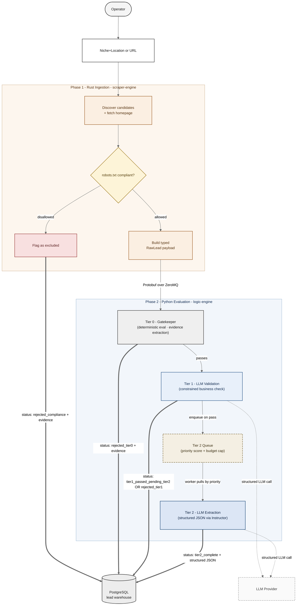

# Evaluation Cascade

## What this diagram answers

Why is the evaluation system staged as Tier 0 → Tier 1 → Tier 2 instead of one large model call, and how does the architecture stay cost-aware while honoring the No-Drop data mandate?

## Diagram

## How to read it

The cascade flows top to bottom. Phase 1 (Rust ingestion) and Phase 2 (Python evaluation) are explicit zones — Phase 1 shapes the lead, Phase 2 evaluates it. Bold arrows pointing into Postgres show **terminal write events**: every lead exits to the warehouse via exactly one of these arrows, in a known `pipeline_status`. That is the No-Drop guarantee, made visual.

## Tier responsibilities

**Phase 1 — Rust scraper-engine.** Discovers candidates, fetches homepages, checks `robots.txt` compliance, and builds a typed `RawLead` payload. Compliance-disallowed sites are never fetched but are still persisted as `rejected_compliance` so the lead is queryable later (No-Drop applies pre-evaluation too).

**Tier 0 — Gatekeeper (deterministic).** Heuristic scan plus deterministic evidence extraction (mobile readiness, contact presence, forms, trust markers, crawl state). Cheap, no LLM tokens spent. Rejects obvious junk and campaign mismatches; passes the rest forward with the evidence attached.

**Tier 1 — Constrained LLM Validation.** A narrow LLM call that answers a single question: "is this site a real local business in the target niche?" Constrained to a small structured output. Cheap relative to Tier 2 but expensive relative to Tier 0.

**Tier 2 Queue.** When Tier 1 passes, the lead is immediately persisted with status `tier1_passed_pending_tier2` (a weak label) and enqueued. Each enqueued lead carries a `tier2_priority` score derived from Tier 0 evidence and Tier 1 confidence. A budget cap (per-run or daily USD) governs how much Tier 2 spend the queue can authorize.

**Tier 2 — Structured Extraction.** Workers pull from the queue in priority order, run the most expensive call (full structured extraction via Instructor JSON schema), and update the existing row to `tier2_complete` (strong label).

## Architectural commitments visible in this diagram

**1. No-Drop persistence.** The four bold arrows into Postgres make the invariant unmissable: every lead — compliance-excluded, Tier 0 rejected, Tier 1 rejected, Tier 1 passed but pending Tier 2, or Tier 2 complete — has a row with a known status. There are no silent drops.

**2. Cost discipline through staging.** Cheap deterministic checks run first; LLM tokens are only spent on candidates that earn them. Tier 0 filters obvious junk before any model call. Tier 1 filters non-businesses before the heavyweight Tier 2 extraction runs.

**3. Decoupled write and run for Tier 2.** Tier 1 always persists its result before Tier 2 runs, never instead of. This means a lead that passes Tier 1 but never gets Tier 2 enrichment (queue stalled, budget exhausted, worker failure) is still in the warehouse as a queryable weak label, not lost.

**4. Priority + budget gating.** Tier 2 dispatch is async and cost-aware. Best-scored leads earn enrichment first; lower-priority leads stay as weak labels until budget refreshes. This is the difference between "we sometimes don't finish processing leads" and "we make principled cost decisions about which leads earn LLM enrichment."

## Data flywheel implications

The `pipeline_status` field partitions the warehouse into label strengths:

- **Weak labels** (`tier1_passed_pending_tier2`) — deterministic evidence + Tier 1 validation, no Tier 2 extraction.
- **Strong labels** (`tier2_complete`) — full deterministic + LLM-extracted structured record.
- **Rejection labels** (`rejected_*`) — terminal negatives with reasons; useful for hard-negative training of a future student model.

A future student-model training pipeline can weight these differently or filter to strong labels only, without losing the underlying coverage that weak and rejection labels provide.

## Related diagrams

- [System Context](../README.md#architecture) — the recruiter-friendly zoom-out of the same system.
- [Pipeline Sequence](./pipeline-sequence.md) — time-ordered behavior view of the same cascade.
- [Data Lifecycle](./data-lifecycle.md) — how a single lead's row evolves across tier writes and updates.
