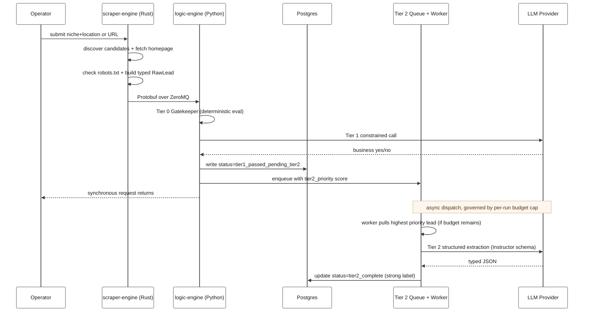

# Pipeline Sequence

## What this diagram answers

When one lead enters the system, what is the time-ordered sequence of calls between services, and where does the synchronous path end and the async Tier 2 path begin?

## Diagram

## How to read it

The diagram shows the **happy path**: a lead that survives every gate and reaches Tier 2 enrichment. The implicit horizontal line at the `Note over Q, LLM` annotation splits the timeline. Everything above the note runs **synchronously** within a single ingestion request and returns to the operator as soon as Tier 1 finishes. Everything below the note runs **asynchronously** on a separate worker, on its own schedule, governed by budget — Tier 2 is decoupled from the original request entirely.

Rejection branches are deliberately omitted from the diagram to keep the timing story clear. The full decision tree (compliance rejection, Tier 0 rejection, Tier 1 rejection) is visualized in the [Evaluation Cascade](./evaluation-cascade.md) flowchart. Behaviorally, every rejection takes the same shape: the rejecting service writes a terminal `rejected_*` row to Postgres and returns. No lead is dropped silently.

## Key behaviors visible in this diagram

**1. Two services, two writers.** Both `scraper-engine` (Rust) and `logic-engine` (Python) write directly to Postgres. The compliance-rejected path (not shown) never crosses the ZeroMQ boundary because there is nothing for Phase 2 to evaluate — the Rust side persists the rejection itself. This is why the No-Drop mandate is enforced at the database layer, not at a single service.

**2. Tier 1 always writes before Tier 2 runs.** When Tier 1 passes, the row is committed with `tier1_passed_pending_tier2` *before* the lead is enqueued. If the queue stalls, the worker dies, or the budget is exhausted, the lead is still in the warehouse as a queryable weak label. Tier 2 enriches the existing row; it never gates whether the row exists.

**3. Tier 2 is dispatched, not awaited.** The synchronous request returns to the operator as soon as Tier 1 finishes. The Tier 2 worker is a separate process pulling from a priority queue with a budget cap. This is the cost-discipline boundary: scaling Tier 2 spend up or down is an operational dial, not a code change.

**4. The LLM Provider is called from two places.** Tier 1 (constrained validation) and Tier 2 (structured extraction) both hit the LLM, but on different paths — Tier 1 inline during the request, Tier 2 from the async worker. This makes the cost-tier boundary explicit: cheap call on the hot path, expensive call only when budget says so.

## Related diagrams

- [System Context](../README.md#architecture) — recruiter-friendly zoom-out of the same system.
- [Evaluation Cascade](./evaluation-cascade.md) — decision-flow view including all rejection branches.
- [Data Lifecycle](./data-lifecycle.md) — how a single lead's row evolves across these writes.
