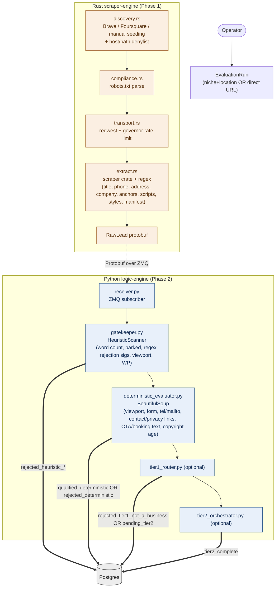

# Phase 1 Recon — Tier 0 Deep Analysis

> Goal: understand the existing data flow and identify untapped signals in the data Rust already collects, so Tier 0 can score leads more deterministically before any LLM tokens are spent.

## TL;DR

The Rust scraper-engine sends a **rich** RawLead payload (12 distinct artifact families), but the Python Tier 0 layer currently uses **roughly 30%** of that data for evaluation. The remaining 70% is persisted to Postgres but never analyzed. Most of the highest-signal evidence for "is this a real, modernization-ready, in-niche business?" lives in the unused 70%.

The opportunity in Phase 2 is to extract deterministic signals from `script_srcs`, `stylesheet_hrefs`, `response_headers`, `robots_txt.body`, `sitemap_xml.body`, `manifest_url`, and structured DOM patterns inside `raw_html` (Schema.org / generator meta / class prefixes). These signals are high-precision, free to compute, and would let Tier 0 reject more obvious mismatches and surface stronger weak labels for Tier 1.

---

## System map



---

## Data inventory: what Rust sends vs what Python reads

### Protobuf `RawLead` fields → Python usage

| Field | Source | Used in Tier 0? | Notes |
|---|---|---|---|
| `id, timestamp, run_id` | scraper | persisted only | identity |
| `source_url, initial_url, final_url` | scraper | partial | only `urlparse(source_url).netloc` is checked for "directory-like" hosts |
| `discovery_source` | scraper | persisted only | could weight (Brave SERP > Foursquare > manual) |
| `target_industry, target_location` | run config | passed to evaluator | used to switch ruleset |
| `crawl_allowed, crawl_disallowed_reason` | compliance.rs | **used** | hard exclude path |
| `is_no_website_opportunity` | discovery | **used** | hard exclude path |
| `provider_fsq_id` | discovery | persisted only | huge untapped — could pull FSQ firmographics |
| `company_name, category, phone_number, address` | extract.rs | partial | only `phone` and `address` truthy-checked, not validated |
| `provider_provenance_json, website_provenance_json` | discovery + extract | persisted only | confidence values lost |
| `location_confidence, category_confidence` | scraper | persisted only | never used in scoring |
| `http_status` | transport | persisted only | could reject 4xx/5xx |
| `is_https` | transport | persisted only | non-HTTPS in 2026 = strong negative signal |
| `redirect_count` | transport | persisted only | high count = stale infra signal |
| `fetch_duration_ms` | transport | persisted only | slow = pitch angle |
| `response_size_bytes` | transport | persisted only | tiny = parked, huge = bloated WP |
| `content_type` | transport | persisted only | non-HTML = wrong target |
| `response_headers` | transport | persisted only | **goldmine** — server fingerprint, CDN, security headers, cookies revealing CMS |
| `raw_html` | scraper | partial | only ~10 BeautifulSoup calls; full DOM unexploited |
| `text_content` | scraper | **used** | word count, copyright regex, CTA/booking phrase scan |
| `page_title` | extract.rs | partial | truthiness check only |
| `anchor_hrefs` | extract.rs | partial | label/url substring search for contact/privacy/social |
| `script_srcs` | extract.rs | **NOT USED** | the single highest-value untapped field — full tech stack lives here |
| `stylesheet_hrefs` | extract.rs | **NOT USED** | CSS framework + CDN provider |
| `robots_txt` | compliance.rs | partial | only `exists` boolean checked, body content ignored |
| `sitemap_xml` | scraper | partial | only `exists` boolean checked, body content ignored |
| `manifest_url` | extract.rs | persisted only | PWA marker, brand colors, app metadata |

---

## Current Tier 0 logic (what's actually being checked)

### `gatekeeper.py — HeuristicScanner`
- `MIN_WORD_COUNT = 150`
- Parked domain phrase scan ("this domain is for sale", "buy this domain", "parked free", "under construction")
- Per-campaign rejection regexes against full HTML string:
  - `website_modernization`: Squarespace, Shopify CDN, Wix, Weebly
  - `voice_ai_agent`: empty
  - `smma`: empty
- Custom evaluators:
  - `website_modernization`: `missing_mobile_viewport` (no `<meta name="viewport">`), `is_wordpress` (regex on `wp-content|wp-includes`)
  - others: empty

### `deterministic_evaluator.py — evaluate_lead`
DOM/text checks via BeautifulSoup:
- `has_viewport` — `<meta name="viewport">`
- `has_form` — any `<form>`
- `has_tel`, `has_mailto` — anchor `href` regex
- `has_contact_page`, `has_privacy` — anchor label/URL substring scan
- `has_booking` — text contains "book now" / "schedule" / "appointment" / "calendly"
- `has_cta` — text contains "free estimate" / "request quote" / "contact us" / "call now"
- `has_hours`, `has_reviews` — text substring
- `has_phone_signal`, `has_address_signal` — proto fields truthy or DOM fallback
- `directory_like` — host contains yelp/facebook/instagram/tripadvisor

Per-campaign missing-features:
- `website_modernization`: mobile, contact form, CTA, privacy
- `voice_ai_agent`: phone flow, appointment capture, hours
- `smma`: social link count > 0, social proof, CTA

Score formula:
```
score = min(1.0, 0.35 + 0.12 * len(missing) + 0.10 * len(outdated))
is_qualified = is_real_business AND (len(missing) > 0 OR len(outdated) >= 2)
```

### Why the current logic underperforms its data

1. **Single-modality detection.** Most "is this WordPress?" type signals come from one regex on the raw HTML. The same fact is independently visible in `response_headers` (X-Powered-By, Set-Cookie, Link header), `script_srcs` (`/wp-content/themes/...`, `/wp-includes/js/...`), `stylesheet_hrefs` (same), and `robots_txt.body` (often disallows `/wp-admin/`). Five-way agreement = high-confidence label; one-way = noise.
2. **Builder rejection is hard-coded to four hosts.** Adding GoDaddy Web Builder, Webflow, Carrd, Notion sites, IONOS, etc. requires editing code. Should be config or driven by signature pack files.
3. **No tech stack snapshot.** We can't currently say "this site uses HubSpot CRM and Calendly booking" — both of which are direct buying-intent signals for several campaign types.
4. **No CDN / hosting awareness.** A site on Cloudflare + Vercel + Stripe is materially different from one on shared cPanel hosting in Provo, UT, even if both are WordPress.
5. **Score is linear in feature count.** No signal weighting, no per-campaign learned weights, no confidence intervals. A site missing privacy policy counts the same as a site missing mobile responsive design.
6. **Foursquare data is dropped on the floor.** We have `provider_fsq_id` in the row but never enrich with rating, review count, popularity, or "verified" status from FSQ — all strong realness signals.

---

## Cross-reference: Protobuf shape vs Postgres shape vs Python pydantic

All three layers agree on the field set. ScoredLeadModel in `database.py` mirrors RawLead 1:1 plus adds:
- Workflow state: `pipeline_status`, `score`
- Tier 0 outputs: `heuristic_flags`, `deterministic_evidence`
- Qualification booleans: `is_qualified_lead`, `has_booking_widget`, `is_mobile_optimized`, `has_clear_contact_info`
- Free-form: `overall_digital_health`, `rejection_reason`
- Lists: `identified_service_gaps`, `missing_critical_features`
- LLM holding fields: `llm_output`, `full_llm_payload`, `llm_processing_cost`

`schemas.py` defines the Tier 2 LLM extraction shape (LeadExtraction + ServiceGaps) which mostly mirrors what Tier 0 already attempts to compute deterministically. **This is intentional and good** — Tier 2 can then validate/refine the deterministic extraction, and we can compare T0 vs T2 outputs to learn signal weights for the eventual XGBoost model.

No schema mismatches detected. Storage capacity for new evidence is already there: `heuristic_flags` (JSON) and `deterministic_evidence` (JSON) can absorb arbitrary new signal output without migration.

---

## High-value signal opportunities (preview of Phase 2)

These are the families of deterministic signal we can extract from already-collected data, ranked by signal-to-cost ratio.

### S-tier (free, deterministic, high precision)

1. **Tech stack from `script_srcs`** — Wappalyzer-style fingerprinting against ~600 known signatures. Detects analytics, CRM, payments, booking, page builders, frameworks, A/B tools, chat widgets. Most impactful single addition.
2. **CMS / builder from `response_headers` + `set-cookie`** — `X-Powered-By: PHP/8.1`, `wp_*` cookies, `_shopify_*` cookies, `cf-ray`, `x-vercel-id`, `server: nginx/openresty` cluster — pin platform with high confidence.
3. **Schema.org JSON-LD parsing in `raw_html`** — `LocalBusiness`, `Restaurant`, `ProfessionalService`, `Organization` with `address`, `telephone`, `openingHours`, `aggregateRating` — converts maybe-business into known-business in one pass.
4. **`<meta name="generator">`** — explicit CMS declaration ("WordPress 6.5.2", "Wix.com Website Builder", "Squarespace 7.1", "Shopify").
5. **Class/ID prefix scan** — `wp-`, `elementor-`, `et_pb_` (Divi), `sqs-`, `wix-`, `gb-` (GenerateBlocks). Matches platform with high precision even when other markers are stripped.

### A-tier (free, deterministic, medium-high precision)

6. **`stylesheet_hrefs` framework detection** — Tailwind, Bootstrap, Bulma, Material UI, font CDNs.
7. **`robots_txt.body` parsing** — extract Sitemap URLs (sitemap depth = site maturity), bot policy maturity (LLM bots blocked = recent attention), revealed admin paths.
8. **`sitemap_xml.body` parsing** — URL count (proxy for content depth), last-mod recency (freshness), priority distribution.
9. **HTTPS + security headers** — HSTS, CSP, X-Frame-Options, Referrer-Policy presence indicates security maturity.
10. **HTTP/2 vs HTTP/1.1, Brotli support** — modern infra markers (`alt-svc`, `content-encoding`).
11. **Performance markers** — `fetch_duration_ms` quartile per industry, `response_size_bytes` outliers.
12. **`manifest_url` presence + parse** — PWA = modern build, manifest content reveals brand colors and app metadata.

### B-tier (cheap, probabilistic, useful in ensemble)

13. **Anchor href external link audit** — booking widgets (`calendly.com`, `acuityscheduling.com`, `squareup.com/appointments`), reservation systems (`opentable.com`, `resy.com`, `tock.com`), review platforms (`g.page/`, `yelp.com/biz/`), app store badges.
14. **Domain age proxy** — copyright year regex (already collected) + earliest sitemap last-mod.
15. **Foursquare enrichment** — pull rating, popularity, photo count, verified status using the stored `provider_fsq_id`. Big realness signal.
16. **Discovery source weighting** — Brave SERP top-10 lead generally outranks Foursquare-derived in business viability.
17. **Title/H1 entropy** — generic templated titles ("Home | Your Business Name") indicate unbuilt site.

### C-tier (cheap but noisy, gate behind ensemble vote)

18. **Image alt text completeness** — accessibility maturity proxy.
19. **Inline `<style>` ratio vs external** — high inline = templated builder.
20. **`<noscript>` + lazy-loading attributes** — modern build indicators.
21. **HTML doc size vs text content ratio** — high markup-to-text = bloated builder/ad-heavy.

---

## Where these signals plug in

**Storage:** All new signals fit inside the existing `heuristic_flags` and `deterministic_evidence` JSON columns. No DB migration required for the first iteration. Once signals stabilize, promote the most-valuable ones to typed columns for query performance.

**Code locations:**
- New `signals/` package under `logic-engine/`, one module per signal family:
  - `signals/tech_stack.py` (script_srcs + stylesheet_hrefs + headers)
  - `signals/cms_fingerprint.py` (headers + cookies + class prefixes + generator)
  - `signals/structured_data.py` (JSON-LD, microdata)
  - `signals/infra_quality.py` (HTTPS, security headers, CDN, performance)
  - `signals/site_depth.py` (sitemap, robots.txt body, link inventory)
  - `signals/external_integrations.py` (booking, payments, reviews, social)
- `gatekeeper.py` calls each signal module, merges flags into the existing dict shape.
- `deterministic_evaluator.py` scoring upgraded to a weighted ensemble that consumes the merged flags.

**Backwards compatibility:** zero regressions if new signal modules return `{}` on missing data. Existing rejection paths and score formula stay as default fallback during rollout.

---

## What I need from Tee to start Phase 2

1. **Confirm priority order** for signal modules above. Default plan: ship S-tier (1-5) first, validate against a 20-good / 20-bad benchmark, then iterate.
2. **20 known-good leads** (URLs you'd qualify) and **20 known-bad** (URLs you'd reject). Will use as the labeled validation set for measuring precision/recall per signal.
3. **Decision:** signature packs (Wappalyzer-style YAML/JSON) hand-curated from scratch, or vendor an existing library (e.g., `python-Wappalyzer`, `wappalyzer-rs`, builtwith's open dataset)? Recommend curated subset of Wappalyzer's open signatures to avoid reinvention.
4. **Decision:** weights configured per campaign in YAML (auditable, manual) or learned via XGBoost from teacher labels (the roadmap Phase 5 plan). Recommend YAML weights now, XGBoost when dataset saturates.

## Phase 2 deliverable preview

End-state of Phase 2: a single `signals/registry.py` that runs all signal modules in parallel, returns a typed dict, and feeds a weighted scoring function. Each signal carries `(name, value, confidence, source_field)` so every score is auditable. New signals added by dropping a module + entry in registry. Per-campaign weight YAML lives under `logic-engine/campaigns/`. Output is wire-compatible with the existing `heuristic_flags` / `deterministic_evidence` columns.

---

*Generated as part of Phase 1 recon. No code changes made — this doc is read-only analysis and a Phase 2 plan.*
